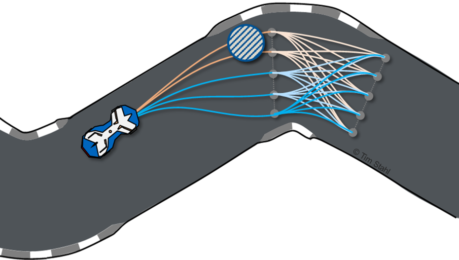

# Graph-Based Local Trajectory Planner



The graph-based local trajectory planner is python-based and comes with open interfaces as well as debug, visualization
and development tools. The local planner is designed in a way to return an action set (e.g. keep straight, pass left,
pass right), where each action is the globally cost optimal solution for that task. If any of the action primitives is
not feasible, it is not returned in the set. That way, one can either select available actions based on a priority list
(e.g. try to pass if possible) or use an own dedicated behaviour planner.

The planner was used on a real race vehicle during the Roborace Season Alpha and achieved speeds above 200kph.
A video of the performance at the Monteblanco track can be found [here](https://www.youtube.com/watch?v=-vqQBuTQhQw).

### Disclaimer
This software is provided *as-is* and has not been subject to a certified safety validation. Autonomous Driving is a
highly complex and dangerous task. In case you plan to use this software on a vehicle, it is by all means required that
you assess the overall safety of your project as a whole. By no means is this software a replacement for a valid 
safety-concept. See the license for more details.


### Documentation
The documentation of the project can be found [here](https://graphbasedlocaltrajectoryplanner.readthedocs.io/).


### Contributions
[1] T. Stahl, A. Wischnewski, J. Betz, and M. Lienkamp,
“Multilayer Graph-Based Trajectory Planning for Race Vehicles in Dynamic Scenarios,”
in 2019 IEEE Intelligent Transportation Systems Conference (ITSC), Oct. 2019, pp. 3149–3154.\
[(view pre-print)](https://arxiv.org/pdf/2005.08664>`)

Contact: [Tim Stahl](mailto:stahl@ftm.mw.tum.de).

If you find our work useful in your research, please consider citing: 

```
   @inproceedings{stahl2019,
     title = {Multilayer Graph-Based Trajectory Planning for Race Vehicles in Dynamic Scenarios},
     booktitle = {2019 IEEE Intelligent Transportation Systems Conference (ITSC)},
     author = {Stahl, Tim and Wischnewski, Alexander and Betz, Johannes and Lienkamp, Markus},
     year = {2019},
     pages = {3149--3154}
   }
```
