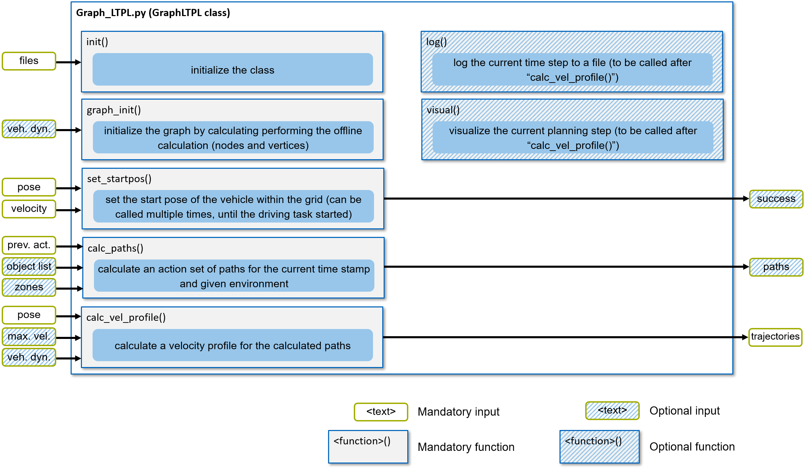

===================================
Using the Planner Package
===================================
This page describes the basic steps when using the planner (along with the two exemplary launch files). Furthermore,
the tools coming with the local trajectory planner are introduced. Here, the focus is on the basic implementation and
usage, a detailed documentation of all the functions, parameters and return values is in the
:doc:`../../software_imp/modules`.

*Figure 1: Simplified visualization of the GraphLTPL class with its functions and inputs / outputs.*

Figure 1 shows the core functions of the GraphLTPL class. The visualization highlights mandatory functions and inputs
with a solid infill, while optional functions and inputs are hatched. The key steps are shown in the following snippet:

.. code-block:: python

    import graph_ltpl

    # instantiate class and initialize graph
    ltpl_obj = graph_ltpl.Graph_LTPL.Graph_LTPL()
    ltpl_obj.graph_init()
    ltpl_obj.set_startpos()

    while True:
        # <-- get previously chosen trajectory set -->
        # <-- update objectlist -->

        <path data> = ltpl_obj.calc_paths()

        # <-- update dynamic parameters of ego vehicle -->

        <trajectory data> = ltpl_obj.calc_trajectories()

        # logging - optional
        ltpl_obj.log()

        # live visualization - optional
        ltpl_obj.visual()

In the following, the individual steps are outlined in more detail. First the mandatory initialization steps are
addressed, followed by mandatory iterative steps and optional functions.

Initialization
-------------------------
Before working with the class, it has to be imported to your python script, this is done by the following command:

.. code-block:: python

    import graph_ltpl

Next, the class itself has to be initialized.

.. code-block:: python

    ltpl_obj = graph_ltpl.Graph_LTPL.Graph_LTPL(path_dict=path_dict,
                                                visual_mode=True,
                                                log_to_file=False)

The class initialization takes two boolean flags for the use of the 'visual_mode' (initialization of the
live-visualization) and the 'log_to_file' function (preparation of the log-files). If any of these is set to 'False',
the corresponding function call ('log()' or 'visual()') will have no effect. Furthermore, the class initialization takes
a path dictionary ('path_dict'). The path dict can be set up as follows:

.. code-block:: python

    path_dict = {'globtraj_input_path': "path/to/globtraj.csv",
                 'graph_store_path': "path/to/stored_graph.pckl",
                 'ltpl_offline_param_path': "path/to/ltpl_config_offline.ini",
                 'ltpl_online_param_path': "path/to/ltpl_config_online.ini",
                 'log_path': "path/to/logging_folder/",         # only if 'log_to_file=True'
                 'graph_log_id': "unique_id123"                 # only if 'log_to_file=True'
                 'graph_log_path': "path/to/logging_folder/"    # only if 'log_to_file=True'
                 }

An exemplary and flexible setup of this path dict is shown in the 'main_min_example.py' (without logging) and
'main_std_example.py' (with logging) in the root of the repository.

Once the class is initialized, one can trigger the initialization of the graph. If the graph has not been calculated in
a previous software execution, this process may take some time (several minutes). To trigger the initialization, use the following
command:

.. code-block:: python

    ltpl_obj.graph_init()

As shown in Figure 1, this step allows to optionally provide some vehicle dynamics parameters. The detailed parameter
description can be found in the :doc:`../../software_imp/modules`.

Before starting the autonomous driving part, the start pose of the vehicle is initialized with the following command:

.. code-block:: python

    ltpl_obj.set_startpos(pos_est=pos_est,
                          heading_est=heading_est)

.. note::
    The 'set_startpos()' function returns an optional boolean flag, whether the initialization succeeded (i.e. vehicle
    on track and pointing in correct direction). On a real vehicle, the software is often started in the pit, driven to
    the grid by an human which then exits the vehicle. Therefore, it is possible to add this function to the iterative
    part and set the startpos iteratively, until the returned flag indicates a successful initialization.

Mandatory iterative steps
-------------------------
Within the iterative steps, the planner first plans a spatial path for different action primitives and then plans a
matching velocity profile. The corresponding steps are outlined in the following.

In order to calculate the paths, the following function call must be triggered:

.. code-block:: python

    ltpl_obj.calc_paths(prev_action_id=sel_action,
                        object_list=obj_list,
                        blocked_zones=zone_example)

By doing so, the specifier (string) of the previously chosen action primitive has to be provided. This is the case,
since the planner must find a smooth transition from the passed path to the new generated / planned one (imagine two
trajectories - one going left, one right - in the previous time step, the planner must now know, which of the two
was chosen in order to continue from the slightly left turned or right turned pose).

Furthermore, in this step it is possible to provide an object list with all vehicles to be considered in the next
planning step. The object list is a list of dicts, where each dict describes an object / vehicle and must at least host
the following keys:

.. code-block:: python

    obj1 = {'id': "unique_id123",   # id of the object
            'type': "physical",     # type 'physical' (only class implemented so far)
            'X': 123.0,             # x coordinate
            'Y': 0.123,             # y coordinate
            'theta': 0.02,          # orientation (north = 0.0)
            'v': 50.2,              # velocity along theta
            'length': 3.2,          # length of the object
            'width': 2.5            # width of the object
           }

    obj_list = [obj1, obj2]

.. note:: In this published version, only a short constant velocity (CV) prediction (200ms) of other vehicles is
    implemented. In order to enable safe maneuvers, your own prediction of other vehicles must be provided. Since the
    planner is split into a sequence of spatial and temporal planning, the prediction must be translated into the
    spatial domain only (i.e. the nodes / edges blocked in the current iteration are blocked for all temporal steps).

    The prediction itself can be provided in two ways. One option is to provide the prediction via the object list.
    In this favor, the object dict should host the key 'prediction', hosting a numpy array, where each line represents
    a position to be blocked in the graph (with the dimensions / radius of the object). For a more sophisticated /
    individual concept, we recommend the integration in the 'data_objects/ObjetListInterface.py' class.

In addition, it is possible to provide a blocked zones (regions on the track to be avoided by the ego-vehicle). An
exemplary small zone is given in the 'main_std_example.py'.

The planned paths are stored inside the class but can also be retrieved from the return value of the function call (e.g.
for visualization or decision making based on the path).

Finally, a the velocity profile is planned for the calculated paths.

.. code-block:: python

    ltpl_obj.calc_vel_profile(pos_est=pos_est,
                              vel_est=vel_est)

In order to plan the velocity profile, at least the position and velocity estimate of the current position must be
provided. It should be noted, that the position is only used to project the position onto the last planned path (instead
of iteratively starting the plan at the actual position of the vehicle, which would cause feedback loops interfering
with the controller). The velocity estimate is required in order to calculate a set point velocity, when following a
lead vehicle.

Furthermore it is possible to provide further (optional) vehicle dynamics parameters as well as an maximum velocity
(e.g. currently set by a race control). The function returns at least one trajectory for each feasible action primitive.

.. note::
    The trajectory set is provided in the following format:

    .. code-block:: python

        {"straight": <list of trajectories>,
         "left":     <list of trajectories>,
         "right":    <list of trajectories>}

    Each list of trajectories might be an empty set or one (default) to multiple trajectories. Each trajectory in this
    list is an numpy array with the columns [s, x, y, heading, curvature, vx, ax].

    Furthermore, a unique ID for each action primitive is returned. The ID is an uint32 number and generated by the
    following scheme:

    * Each set of trajectories obtains a base number incrementally growing in decade steps [10, 20, 30, ...]
    * Each individual trajectory obtains an added type specifier with the following convention
      `['straight': 0, 'follow': 1, 'left': 2, 'right': 3, <type_error>: 9]`

Further details about the parameters and return values can be found in the code documentation
(:doc:`../../software_imp/modules`).

Optional iterative steps
-------------------------
Besides the mandatory steps, two optional functions may be called at the end of the iteration (after the
'calc_vel_profile()' function).

The 'log()' function can be called when the corresponding flag was set and all required paths were provided on class
initialization. The function does not require any parameters and does not return any values. The function writes the
(internally stored) information of the current planning step to a file.

The 'visual()' function can be called when the corresponding flag was set during initialization. The function does not
require any parameters and does not return any values. The function updates the live-visualization by refreshing all
changed information (e.g. planned path, obstacle positions).

.. note:: Rendering the live-visualization is computationally expensive and slows down the trajectory planner by a
    factor of 2-3. It is also possible to trigger the 'visual()' function only every n-th iteration.

Sub-packages of the graph_ltpl
------------------------------

* `data_objects`: This python module holds larger data structures (i.e. classes) providing the interface for basic
  manipulation procedures.
* `helper_funcs`: This python module contains various helper functions used in several other functions when
  calculating the local trajectories.
* `imp_global_traj`: This python modules handles the import and pre-processing of a global trajectory for the local
  planner.
* `offline_graph`: This python module holds all relevant functions for the offline generation of the graph.
* `online_graph`: This python module holds all relevant functions for the online execution of the graph.
* `testing_tools`: This folder hosts simple scripts for standalone simulations on the local machine.
* `visualization`: This python module contains functions used for visualization

The individual classes and functions are specified in the :doc:`../../software_imp/modules`.
