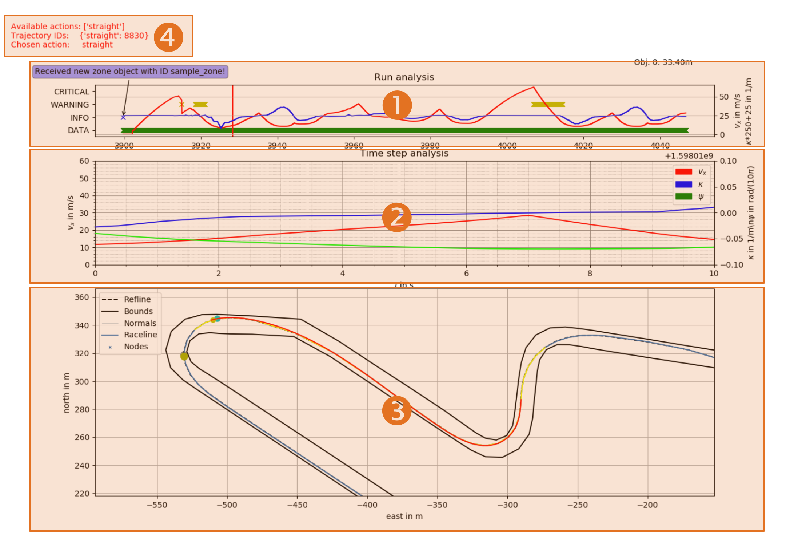
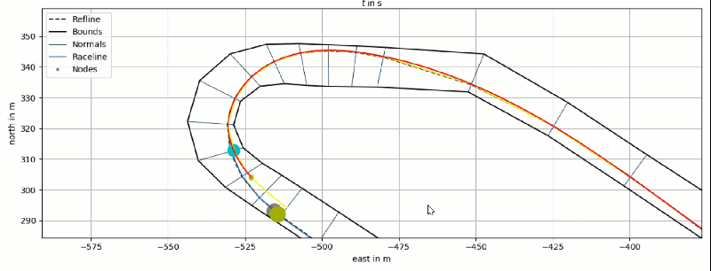

===================================
Log Visualization
===================================
The stored logs generated during execution of the planner (if the logging functionality was activated) can be viewed
with an log-visualization tool.

Launch of the Tool
===================================

The corresponding script is located in the folder 'graph_ltpl/visualization/src' and
executed with the following command:

.. code-block:: python

    python3 visualize_graph_log.py

When the log files are stored in a folder 'log' in the root of the repository (as configured in the
'main_std_example.py') the script will automatically load the most recent log. In order to visualize a specific log,
use the following command:

.. code-block:: python

    python3 visualize_graph_log.py path/to/log/xx_xx_xx_data.csv

.. note::
    Each log consists of online information ('\*_data.csv', '\*_msg.csv') and offline information that is stored in a
    pickle of the graph object (only stored when changed due to parameter or track changes). In order to view the logs,
    always both - the online files and the graph pickle - must be present. In order to allow the tool to find the
    corresponding files, always stick to the folder structure demonstrated in the 'main_std_example.py.

Usage of the Tool
===================================

*Figure 1: Key elements of the log viewer.*

The tool consists (Figure 1) of three major plot windows (1 - 3) and additional information in the top left corner (4).
The key functionality of each of the parts is explained in the following.

#. **The run overview segment.** The velocity (red) and curvature (blue) course during the whole run are displayed here.
   That way it is easy to spot curves or certain straights. Events are highlighted with crosses on the corresponding
   time line. That way, each time a new data point was received, a green cross is drawn (green bar in the bottom). In
   a similar manner, information (blue), warnings (yellow) and critical events (red) are highlighted. When hovering
   with the mouse above one of the crosses, a description is shown (see blue bubble on the top left of (1)).
   Furthermore, when dragging them mouse over the run analyses, the information displayed in all of the following
   segments is updated accordingly (e.g. vehicle pose and trajectory at the selected time instance, Animation 1).
#. **The trajectory time step analysis.** In this plot, one can see the course of velocity (red), heading (green) and
   curvature (blue) for all trajectories planned at the selected time stamp. The left most value corresponds to the
   position of the vehicle, values to the right show the course in the temporal future.
#. **The track overview.** In this plot, the overall track is visualized, including the all objects and the ego-vehicle
   with its planned trajectories at the selected time stamp (1). When hovering with the mouse over this plot, the nodes
   in the graph with adjacent edges (and their cost values) are highlighted (Animation 2).
#. **Additional information.** Information about the generated trajectory at the selected time stamp (1) is shown here.
   This includes the available action sets, corresponding trajectory IDs and the action chosen by the behavior planner
   or user.

The process of skidding through certain time stamps and the corresponding update of the other plots is shown in
Animation 1.

.. image:: ../../figures/log_time_selection.gif
  :width: 500
  :alt: Animation Time Selection

*Animation 1: Time selection and corresponding plot update.*

The process of highlighting certain nodes and adjacent edges in the graph is shown in Animation 2. Thereby, the cost of
each edge is displayed. This feature is helpful to understand chosen decisions by the planner in the past.

*Animation 2: Node and edge highlight in the track plot.*

When clicking on elements in the legend of the track plot, it is possible to toggle the visibility of the respective
entity. That way it is possible to only display the information needed for a less cluttered view.

*Animation 3: Toggling visibility of elements in the track plot.*
