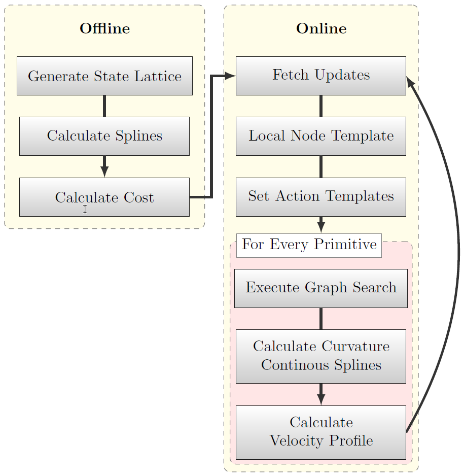

=============================
Repository Overview
=============================

Folder structure
================
The repository is composed of different components. Each of them is contained in a sub-folder.

+-------------------+--------------------------------------------------------------------------+
| Folder            | Description                                                              |
+===================+==========================================================================+
| docs              | This folder holds documentation files (including this page).             |
+-------------------+--------------------------------------------------------------------------+
| graph_ltpl        | This folder holds the algorithmic part of the local trajectory planner.  |
|                   |                                                                          |
|                   | The contained folders and files are explained in                         |
|                   |                                                                          |
|                   | :doc:`../../software/main` and :doc:`../../software_imp/modules`.        |
+-------------------+--------------------------------------------------------------------------+
| inputs            | This folder holds input files to the trajectory planner, among them are: |
|                   |                                                                          |
|                   | global racelines (including map information) and vehicle dynamics config.|
+-------------------+--------------------------------------------------------------------------+
| params            | This folder contains parameterization files for the overall planner.     |
+-------------------+--------------------------------------------------------------------------+

In the root folder is the `main_min_example.py` and `main_std_example.py`-file located. These python scripts allow
an illustrative execution of the planner.

Framework
=========

*Figure 1: Basic execution flow of the planner* [1]_.

In the following, the basic execution steps within the trajectory planner are outlined. The planner is divided into an
online and an offline part (Figure 1), where the goal is to calculate as much information beforehand as possible in
order to keep the online computation effort low.

The *offline* part generates a graph consisting of nodes - a lattice spanning
the whole track - and vertices - cost-assigned splines connecting adjacent nodes. In that favor, first the track and map
information is imported. Then, a state lattice is generated by sampling nodes in equally spaced (for curves and
straights separately parameterizable) layers along the whole track. The lateral displacement of the nodes is chosen
rather small compared to the longitudinal displacement. Afterwards, cubic splines are calculated for each pair of nodes in
adjacent layers. Once completed, the graph is pruned, i.e. loose ends or splines violating the vehicles dynamic
constraints are removed. Finally, a cost value is calculated for each remaining spline in the graph. By doing so, edges
with higher curvatures or larger displacement to the race line receive a bigger cost penalty. Depending on the track
size, this offline process may take some minutes to complete (progress shown in the command line).

The *online* part first fetches latest updates (pose estimate, object list, ...)
and then extracts an online node template from the offline graph. Thereby only nodes belonging to the layers from the
current position up to a specified planning horizon are considered in the next planning step. Furthermore, all edges
intersecting any static or dynamic object in the scene are removed. Within the local node
template a graph subset (action template) is generated for each desired action primitive (e.g. 'pass left', 'pass
right', 'keep straight'). For example, for a 'pass left' template, all nodes to the right of a target vehicle are
removed. That way, only edges passing the vehicle on the left remain in the graph. For each action primitive, a graph
search (e.g. Djikstra) is triggered in the corresponding action template. Afterwards, the resulting path is refined by
calculating a curvature continuous spline passing all returned nodes. A forward-backward planner or SQP-optimizer
then generates a matching velocity profile for each of the C2-continuous splines (maximizing the feasible velocity
based on the configured vehicle dynamics). This process is executed in an repetitive manner.

.. [1] T. Stahl, A. Wischnewski, J. Betz, and M. Lienkamp,
    “Multilayer Graph-Based Trajectory Planning for Race Vehicles in Dynamic Scenarios,”
    in 2019 IEEE Intelligent Transportation Systems Conference (ITSC), Oct. 2019, pp. 3149–3154.
    `(view pre-print) <https://arxiv.org/pdf/2005.08664>`_
